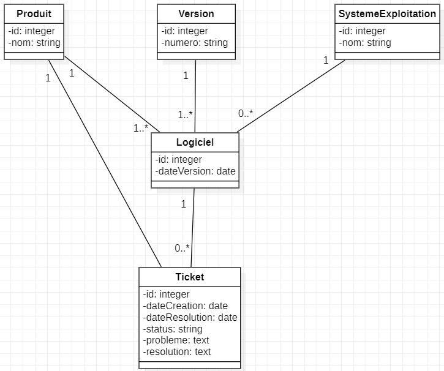

# Projet 6 : Modélisez et créez une base de données pour une application .NET

### Contexte : NexaWorks est une entreprise qui développe différents produits logiciels. Chacun de ces produits peuvent disposer de plusieurs versions ainsi que systèmes d'exploitation. Nexaworks a besoin qu'on leur conçoit une base de données afin de pouvoir avoir un suivi sur les problèmes/résolutions de chaque produit avec leur version et système d'exploitation.

## Modèle Entité-Association

